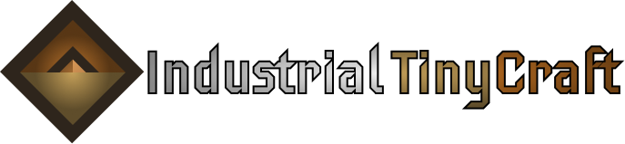
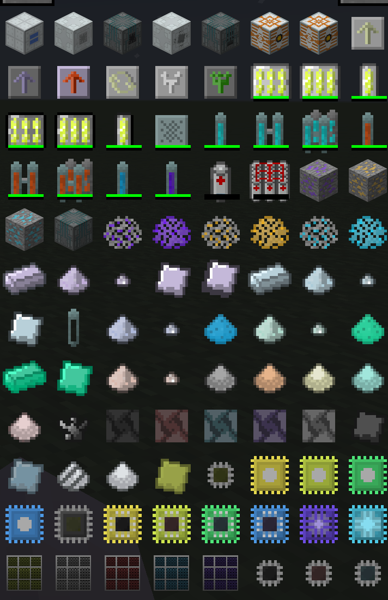

<div align="center">
    

An addon that adds a new industry branch (processors) and research. Have fun!

**Currently in deep development**

[Current RoadMap](./ROADMAP.md)

</div>

### New ores and elements

**Cyrtolite** and **Wulfenite**

**Zirconium** (in reactor components), **Hafnium** (used in electronics), and **Molybdenum** (in heat-resistant materials)

### A new development branch for electronics

Adds different **processor technologies**, each requiring new resources!

Used in almost all electronics of new **items/improvements/mechanisms**

### Reactor things

Adds a neutron moderator, target rods for producing new isotopes

### Upgrades!

In addition to the well-worn upgrades for mechanisms like Overclocker, the project will add "Parallel Processing" upgrades and other more useful upgrades (like "Centrifuge Heating Holder").

### Application of lithium

Also, the previously useless lithium is now used for batteries and the new MFSU. Don't forget to fill them with electrolyte!

### Screenshot



## How to

### Setup project

```bash
./gradlew setupDecompWorkspace
```

### Build

```bash
python3 patch.py build
./gradlew -b build-package.gradle build
```

### Run in IDE

```bash
python3 patch.py run
./gradlew runClient
```

### Why?

Since the current version of ForgeGrudle does not allow the game to run inside the IDE due to internal errors, an outdated version of ForgeGradle and forge is used

Also, assembly on ForgeGradle version 2.3+ is impossible due to internal errors.

So I separated the build and run configurations. But to work with the old version of Forge, some new method names need to be renamed to the old ones, and back again for the build.

That's why I created a patch file that will make it very convenient to use.

I hope this information will be useful to someone.
